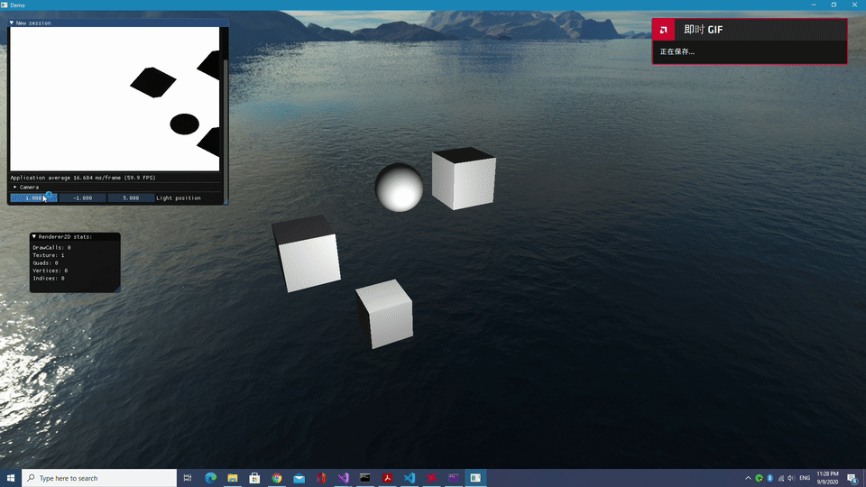

# CG-Sandbox

This is a toy game engine sanbox for game engine architecture design and computer graphics algorithmn practices.
#### Feartures
* 2D quad rendering
* 3D phong lighting model
* Enviroment map
* Shadow map
* Imgui Debug
  
#### Snapshot

#### TODO
* PBR material system
* Multiple light support
* Defferred rendering

#### Reference
This program used the following two game engines as references. 
*   [Lumos](https://github.com/jmorton06/Lumos)
*   [Hazel](https://github.com/TheCherno/Hazel)